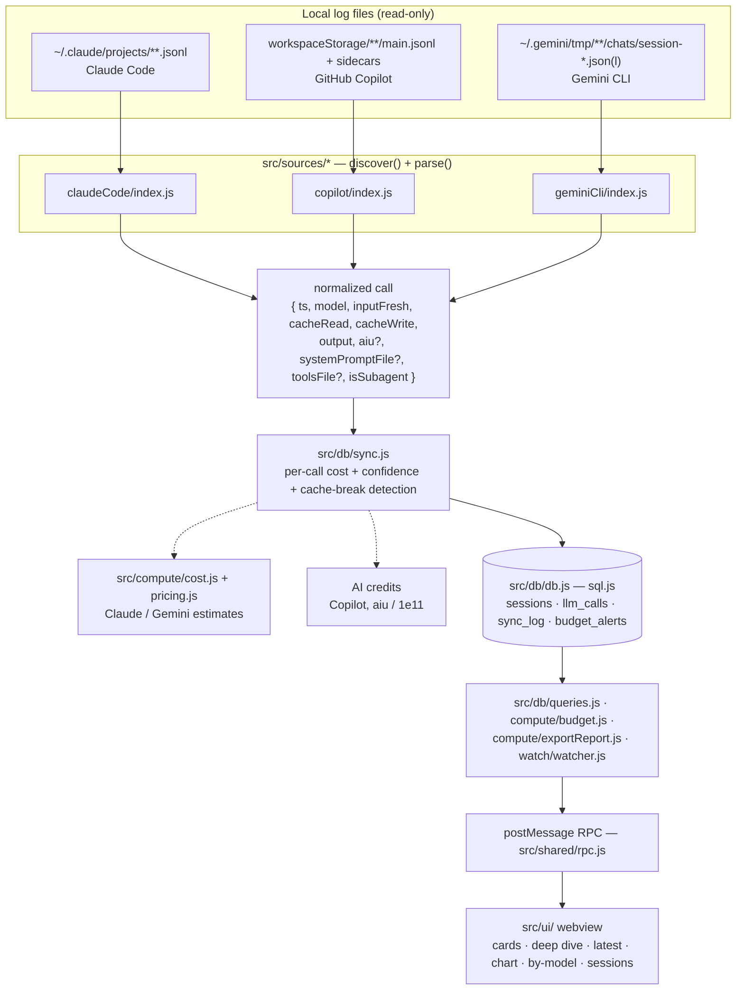

# Architecture

## Modules

| Path | Responsibility |
|---|---|
| `src/extension.js` | Activation, RPC handlers, status bar, budget alerts, watcher wiring, export command. |
| `src/sources/<source>/index.js` | Discover sessions and parse logs into the normalized call shape. |
| `src/sources/<source>/paths.js` | Resolve each tool's log location cross-platform. |
| `src/sources/claudeCode/pricing.json` | Bundled Anthropic base prices (update when prices change). |
| `src/sources/geminiCli/pricing.json` | Bundled Gemini base prices (update when prices change). |
| `src/compute/cost.js` | Source-agnostic per-call cost from a pricing record. |
| `src/compute/pricing.js` | Claude + Gemini family pricing lookups. |
| `src/compute/budget.js` | Today/week spend + one-shot budget alerts. |
| `src/compute/exportReport.js` | CSV/JSON export rows. |
| `src/db/db.js` | sql.js connection + additive column migrations. |
| `src/db/schema.sql` | Base schema. |
| `src/db/sync.js` | Incremental sync: discover → parse → cost/confidence/cache-breaks → persist. |
| `src/db/queries.js` | All read queries (window- and source-aware). |
| `src/watch/watcher.js` | `fs.watch` on all source roots → debounced re-sync (live tracking). |
| `src/shared/rpc.js` | postMessage request/response + notifications. |
| `src/shared/formatters.js` | Pure formatting (USD, tokens, day/week keys) shared host + webview. |
| `src/ui/` | Self-contained webview (no bundler): `index.html`, `app.js`, `styles.css`. |

## Design principles

- **Source-agnostic core.** Only the parsers and the pricing lookup branch per source; the DB, queries, dashboard, budgets, and export treat all data uniformly via the normalized call shape.
- **Token-first.** Tokens/cache are always exact; cost carries a confidence level (see [cost methodology](COST-METHODOLOGY.md)).
- **Incremental & local.** `sync_log` skips unchanged files by mtime+size+parser version; `PARSER_VERSION` bumps force a re-sync when parsing changes. All computed data stays in a local SQLite file; source logs are read-only.

## Data model

- **`sessions`** — one row per session: token sums, `cost_usd`, `ai_credits`, `cost_confidence`, `cache_breaks`, `cache_break_tokens`, `is_estimate`, `has_unknown_model`, source/workspace/title/time.
- **`llm_calls`** — one row per LLM call: token split, `cost_usd`, `ai_credits`, `is_subagent`.
- **`sync_log`** — incremental-sync bookkeeping (file → mtime/size/parser_version).
- **`budget_alerts`** — fired-once markers per period.

Session ids are source-prefixed (`cc:<uuid>` / `cp:<sid>` / `gm:<id>`) so sessions from different tools never collide.
